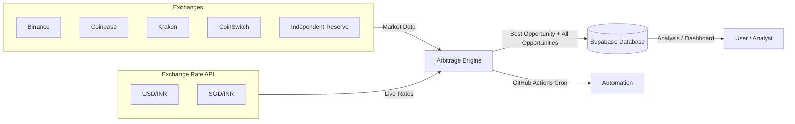

# 💱 Multi-Exchange Crypto Arbitrage Finder

This project is an **automated cryptocurrency arbitrage detection system** that:
- Fetches **real-time prices & quantities** from multiple exchanges.
- Converts between currencies using **live forex rates** (USD/INR, SGD/INR, etc.).
- Applies **taker fees** and **withdrawal fees** from each exchange to compute *net* profit.
- Identifies the **best buy-sell opportunities** across exchanges — even across currencies.
- Stores all opportunities and metadata in a **Supabase database**.
- Runs automatically using **GitHub Actions cron jobs**.

---

## 📌 Supported Exchanges & Currencies

| Exchange              | Quote Currency | Notes |
|-----------------------|---------------|-------|
| **Kraken**            | USD           | Taker & withdrawal fees applied |
| **Independent Reserve** | SGD         | Forex conversion to INR |
| **CoinSwitch**        | INR           | Higher taker fees considered |
| **Binance**           | Varies        | Uses exchange default |
| **Coinbase**          | USD           | Planned integration |

---

## 🗺️ System Architecture



# ⚙️ How It Works

## 1. Market Data Fetching
Each exchange script (`binance.py`, `kraken.py`, `coinswitch.py`, etc.) retrieves:
- **Best ask price** (buy price)
- **Best bid price** (sell price)
- **Available quantity**

## 2. Forex Rate Integration
- `exchange_rates.py` fetches live **USD/INR** and **SGD/INR** rates.
- All prices are normalized to INR for comparison.

## 3. Arbitrage Calculation
The core logic (`find_best_arbitrage_opportunity`) evaluates:
- Buying on one exchange, selling on another.
- Conversion to INR if needed.
- **Gross profit** & percentage.
- **Net profit after fees**:
  - Taker fee (percentage).
  - Withdrawal fee (in coin units → converted to INR).

## 4. Opportunity Filtering
- Ignores unprofitable opportunities.
- Requires **minimum profit %** and **INR gain**.
- Returns both:
  - **Best opportunity**.
  - **All qualifying opportunities**.

## 5. Supabase Storage
Each run pushes opportunities into a Supabase table with:

```json
{
  "coin": "TRX",
  "buy_from": "Kraken",
  "sell_to": "CoinSwitch",
  "buy_price_original": 0.273472,
  "buy_price_in_inr": 23.4092032,
  "buy_original_currency": "USD",
  "sell_price_original": "23.607",
  "sell_price_in_inr": 23.607,
  "profit_in_inr": 0.197797,
  "profit_percentage_before_fees": 0.845,
  "profit_percentage_after_fees": null,
  "timestamp": "2025-05-18T14:33:23.393Z"
}
```

# Arbitrage Finder

## 6️⃣ Automation
- **GitHub Actions cron jobs** trigger the scripts periodically.
- Keeps **Supabase** updated without manual intervention.

---

## 📊 Example Best Opportunity
**Scenario**: Buying TRX on Kraken (USD) and selling on CoinSwitch (INR).

| Metric | Value |
|--------|-------|
| **Buy Price** | 0.273472 USD (~₹23.4092) |
| **Sell Price** | ₹23.607 |
| **Gross Profit** | ₹0.1978 |
| **Gross Profit %** | 0.845% |
| **Net Profit % (after fees)** | *(calculated with taker + withdrawal fees)* |

---

## 🛠 Tech Stack
- **Python** — Data fetching & arbitrage calculation  
- **Supabase** — Cloud DB for storing opportunities  
- **GitHub Actions** — Scheduled automation  
- **REST APIs** — Exchange & forex data  

---
